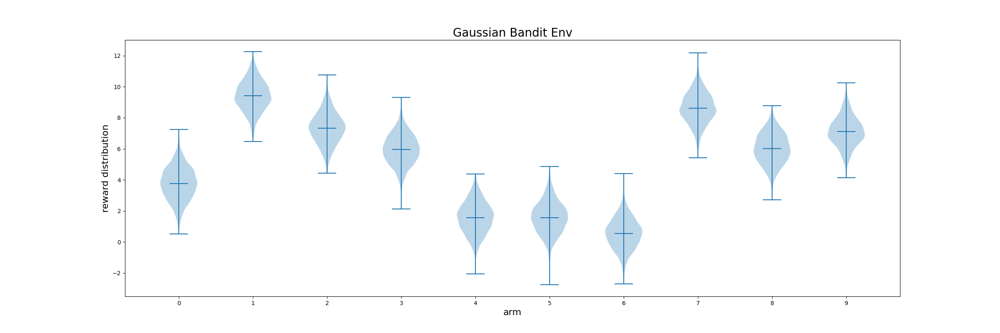
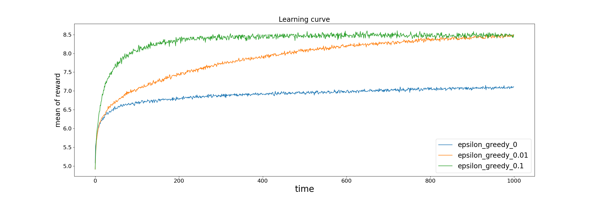
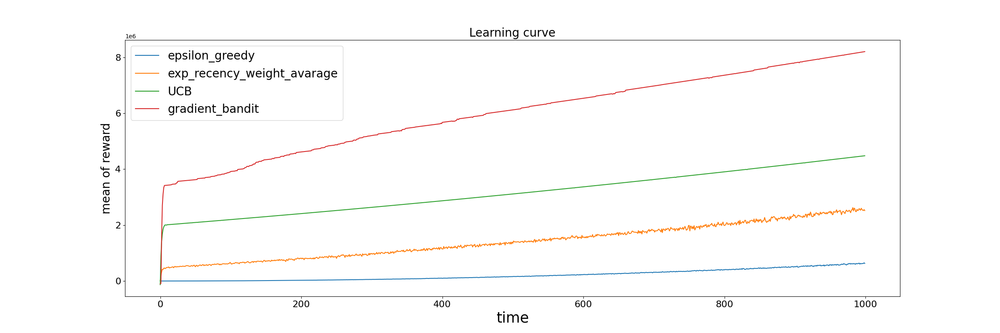

# 強化学習の勉強用
強化学習を勉強するためのリポジトリ。 
参考書籍は以下の通り。

- [強化学習（第2版）](https://amzn.asia/d/aZi6VdS)
- [強化学習 (機械学習プロフェッショナルシリーズ)](https://amzn.asia/d/hc2QY1E)

# バンディット問題
## 定常バンディット問題
各アームの報酬分布が時間によって、変化しないもの。 

例えば、こんな分布。

epsilon greedy法で学習するとこんな感じ。 
epsilonは0, 0.01, 0.1で試した。

このグラフは、2000個のバンディット問題に対して、各ステップごとに報酬を平均した時の時間変化を示したグラフ。 
探索の大事さがよくわかる。 

## 非定常バンディット問題

さっきのような各アームの分布を学習ステップ毎に、一定量ずつ変化させる問題。現実の問題では、各アームの分布が定常なことはないので、こっちの方が実用的か。

exp_recency_weight_averageとは、普通のepsilon greedyの更新量の計数alphaを一定にするもの。こうすると、直近の報酬を重視して最適化できる。 

普通のepsilon greedyよりやはりいい結果になっている。 

UCBは探索するときに、ランダムに探索するのではなく、より報酬が高くなりそうなものを選ぼうというモチベーション。これまたexp_recency_weight_averageより良い結果になっている。 

gradient banditはこれまでとは違い、行動価値関数を使わない。方策とそれを用いて作られた行動の優先度を示す関数Hを用いて、報酬の期待値を表現し、これを最適化するもの。 
UCBより良い結果になってるが、これまでと違い、UCBより明示的に改良されたアルゴリズムという訳ではないはず。実装があってるか心配。