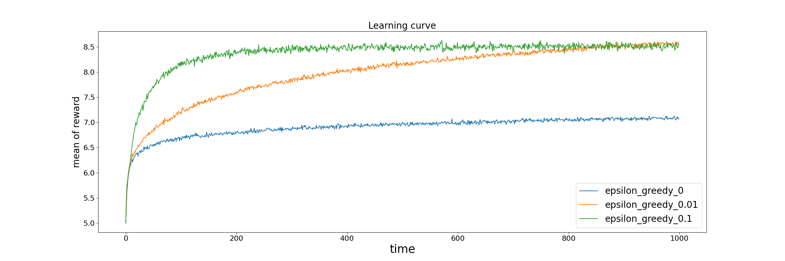

# 強化学習の勉強用

# バンディット問題
## 定常バンディット問題
各アームの報酬分布が時間によって、変化しないもの。 

例えば、こんな分布。

epsilon greedy法で学習するとこんな感じ。 
epsilonは0, 0.01, 0.1で試した。

このグラフは、2000個のバンディット問題に対して、各ステップごとに報酬を平均した時の時間変化を示したグラフ。 
探索の大事さがよくわかる。 